<div align="center">
  <br />
    <a href="https://.vercel.app" target="_blank">
      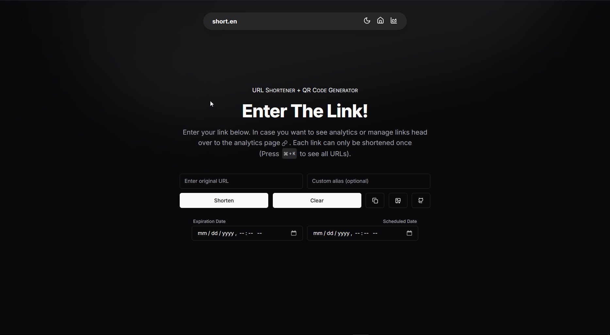
    </a>
  <br />
  <div>
    
    
    
    
    
    
  </div>
  <h3 align="center"> LeanURL <br /> Link Shortener + QR Code Generator </h3>

   <div align="center">
     Visually stunning link shortener for your personal use. Powerful admin dashboard with tons of features and enhanced performance. Ease of use and scalable.
    </div>
</div>

## 🍁 Overview

A Link Shortener + QR Code Generator for *personal* use or use within a *small team*. Fast, reliable and with a visually appealing UI. Scales and supports tons of extra features like scheduled live links, expiration dates and more easily integrable. Features an admin dashboard with everything you need.

### 💻 Technolgoies

[](https://react.dev/ "React JS") [](https://nextjs.org/ "Next JS")  [](https://www.typescriptlang.org/ "Typescript") [](https://tailwindcss.com/ "Tailwind CSS") [](https://vercel.app/ "Vercel")

- **Language**: Typescript (Migrated)
- **Backend**: [Next.js 15](https://nextjs.org/) + [MongoDB](https://www.mongodb.com/) with Mongoose
- **Frontend**: [Next.js 15](https://nextjs.org/) + UI Components via [`shadcn/ui`](https://ui.shadcn.com/) + Tailwind
- **Others**: [Apexcharts](https://apexcharts.com/), [QR Code Styling](https://github.com/kozakdenys/qr-code-styling?tab=readme-ov-file), NanoId, IP-API, React Icons, Axios, Jose, `cookies-next`

## 🚀 Features

- 🔗 **Shorten any link** and generate a corresponding **QR code** (With tons of customization! See second image). You can also assign a **custom alias** if needed.
- 📋 **Quickly copy** the shortened URL or **export the QR code** as a `PNG` file.
- 🌙 **Toggle between themes** for a personalized viewing experience (Custom theme too!).
- 🖥️ **Admin dashboard** that provides all the necessary operations to manage links, filter links, view detailed information for each, and export all data as a **CSV**.
- 🎨 **Beautiful UI elements** designed using **Tailwind CSS** and `ChadCN`, along with icons from **Lucide**. Mobile isn't left out!
- 📈 **Insightful graphs** powered by **ApexCharts**, showing detailed analytics such as the number of times a shortened URL has been used, as well as recent accesses via timestamps, device, browser and country.
- 📅 **Scheduling feature** for setting link live after a certain day and **Expiration Date** which automatically deletes the link from the database using **TTL**.
- 🏗️ **Scalable** architecture to easily add new features as needed.
- 🔒 **Restrictive** access, because who would want someone to come and abuse the service (Uses JWT Tokens)
- 😓 **Restoration** capability incase you or your team member accidentally deleted an old URL


## 🤝 Usage 

1. IN home page simply put in link and fill extra fields if need be and you're good to go
2. Then in admin dashboard you can perform various operations which you can see in the screenshots below
3. For the authorization part just simply go to Mongo and manually insert a document with field `q` and value of the secret code in the same collection as the URLs.

## ⚙️ Setup

```shell
git clone https://github.com/Eshan05/LeanURL
cd LeanURL
npm i
# Look at .env.example
npm run dev
```

## 📱 Screenshots

<div align="center">

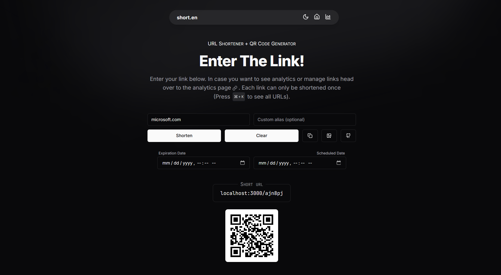
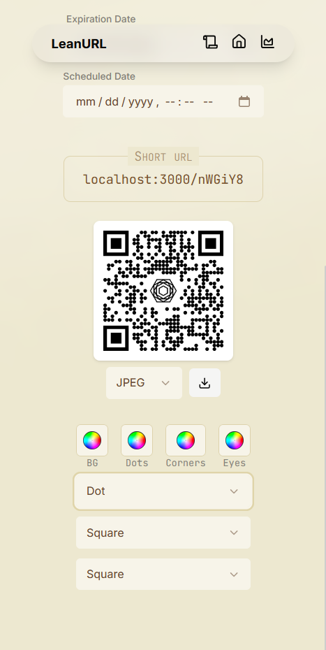
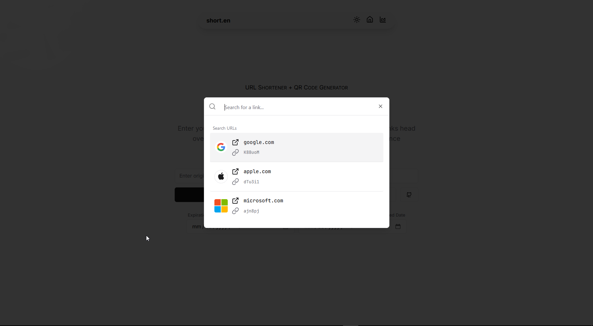
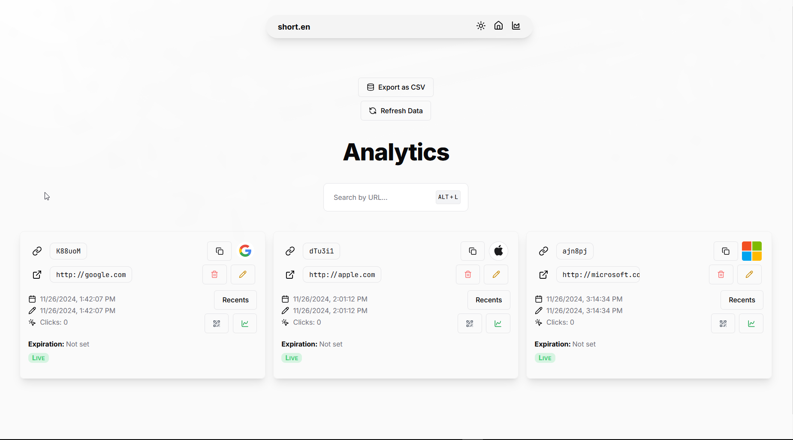
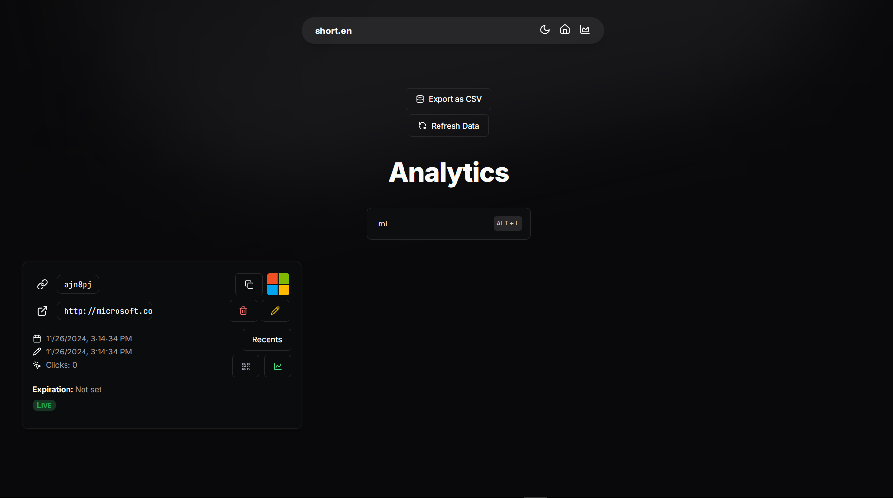
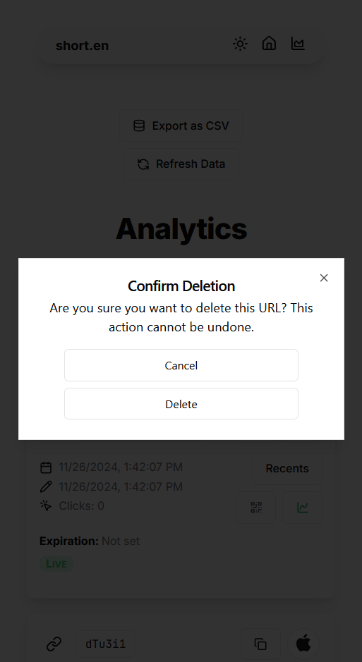
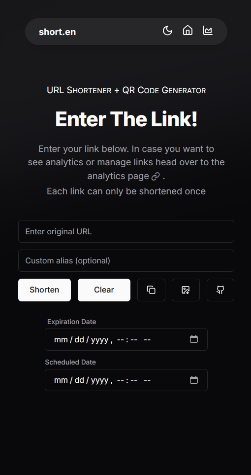
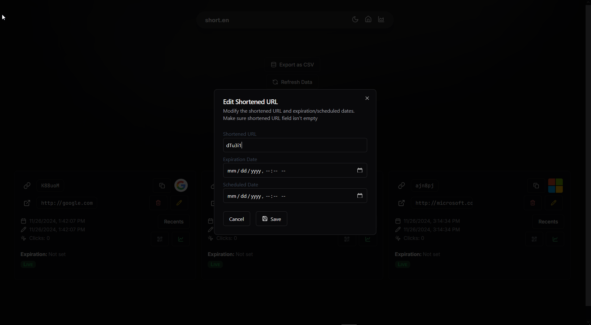
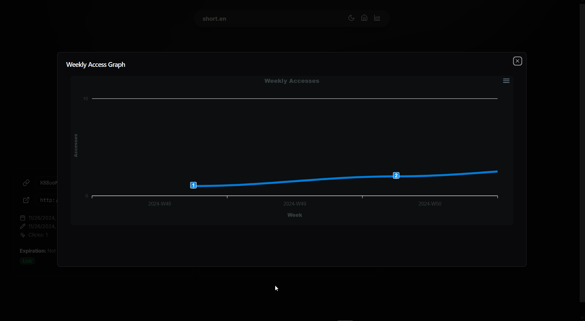
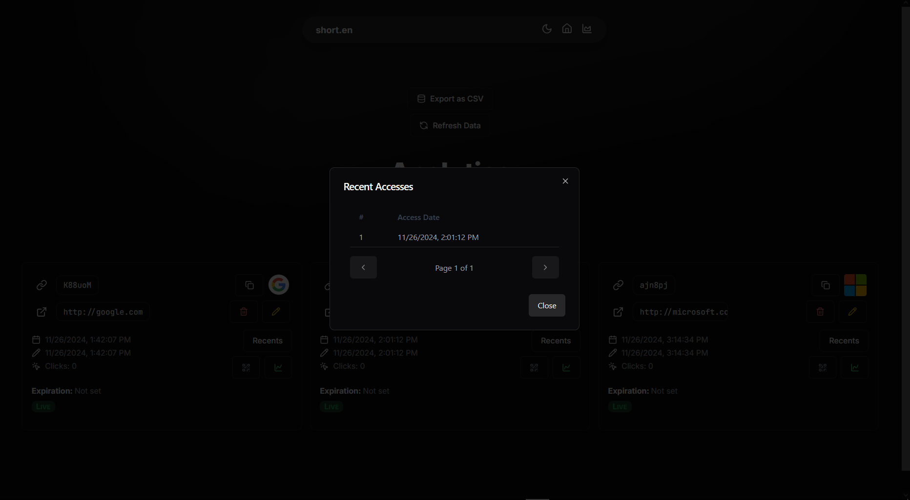
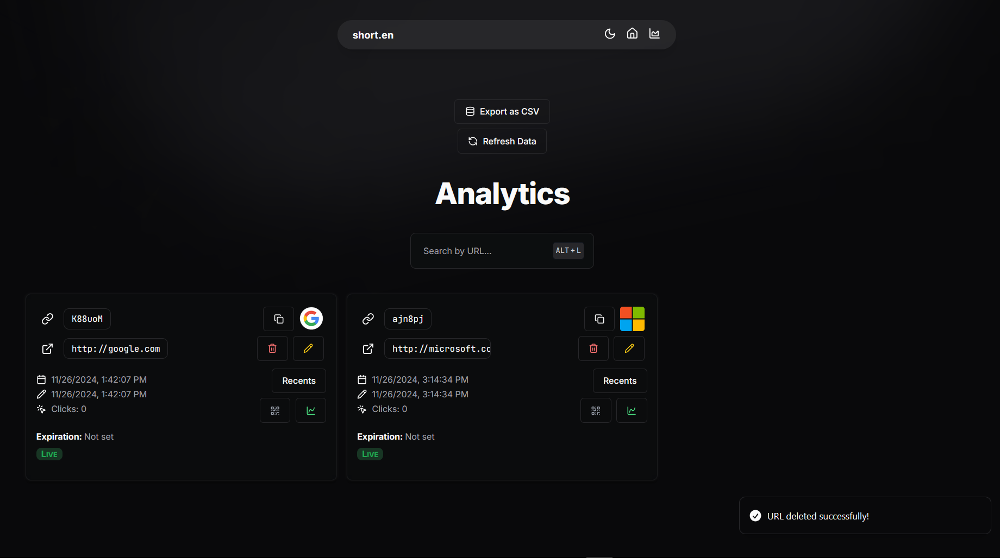
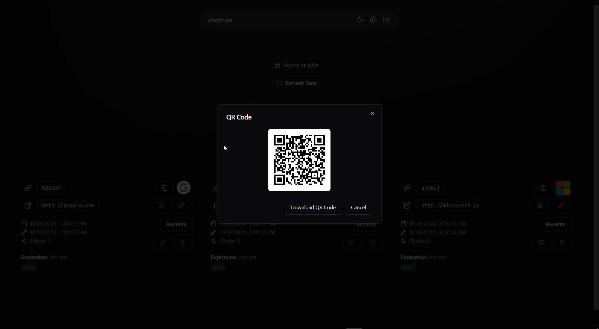
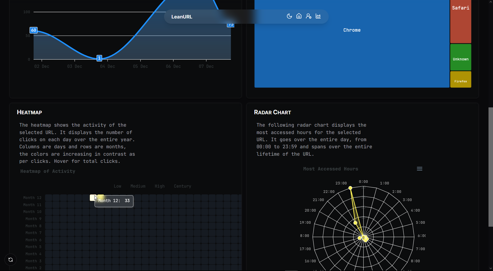

</div>

## 📄 Additional Notes

- See LICENSE (GPLv3)
- Feel free to raise issues if you notice anything wrong
- [Hero section](https://shadcn-ui-blocks.vercel.app/blocks/hero-sections) 
- [Color Picker](https://github.com/Eshan05/Miron/blob/main/components/custom-color-picker.tsx)